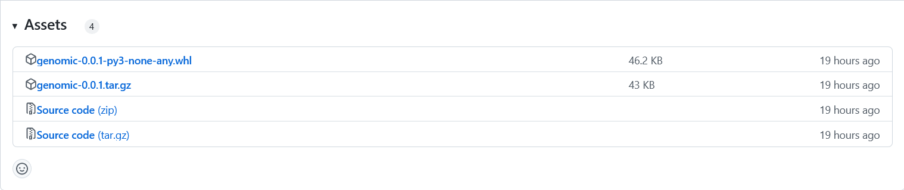

# Glossary

## Instructions

### Cloning Repository

| metodo | comando |
| ------ | ------- |
| https | `git clone https://github.com/frefolli/bioinf-progetto.git` |
| ssh | `git clone git@github.com:frefolli/bioinf-progetto.git` |
| Github CLI | `gh repo clone frefolli/bioinf-progetto` |

### Downloading Release Source Code

Dopo aver [trovato il release](#finding-release), scarica `Source Code` con il formato che preferisci: `.tar.gz` or `.zip`.

### Downloading Release PyPi Package 

Dopo aver [trovato il release](#finding-release), scarica `genomic-*.tar.gz`.

### Finding Release

Vai sulla [pagina github del progetto](https://github.com/frefolli/bioinf-progetto) con il browser browser, vedrai la sezione tags:


Aprendola ci sara' il tag `latest-master`, il quale avra' una sezione chiamata "Assets".



### Installing Module Requirements

Usa `pip install -r requirements.txt`.

### Installing Build Requirements

Usa `pip install build`.

### Installing Documentation Requirements

Usa `pip install mkdocs "mkdocstrings[python]" mkdocs-material`.

### Installing Test Requirements

Usa `pip install flake8 pylint pytest coverage`.

### Building PyPi Package

Usa `python -m build` or `./actions.sh build`

### Installing PyPi Package

Usa `pip install genomic-*.tar.gz`.
Installera' anche le dipendenze del software.

### Running Python Module

Usa `python -m lib -h`, apparira' la schermata di help:


### Running PyPi Package

Usa `genomic -h`, apparira' la schermata di help:


### Running Tests

Per far partire i test, usa `pytest`.

Se ti interessa anche visionare la coverage, usa invece `./actions.sh coverage`.

### Running Lints

Con flake8:

  - `flake8 ./lib/*.py ./tests/*.py --count --select=E9,F63,F7,F82 --show-source --statistics`
  - `flake8 ./lib/*.py ./tests/*.py --count --exit-zero --max-complexity=10 --max-line-length=127 --statistics`

Con pylint:

  - `pylint ./lib/*.py ./tests/*.py --exit-zero`

O direttamente con `./actions.sh lint`

### Running Sonarqube

Usa `./actions.sh CI`.

### Creating New Branch

Il nome della tua nuova branch sara' `dev-{username}-{feature}`.
Dove username e' il tuo username o eventualmente un suo acronimo,
e feature e' una breve descrizione della tua contribuzione.

Prima di tutto assicurati di essere sul branch master.

digitando `git branch` dovrebbe ritornare qualcosa come:

```git
  ...
* master
  ...
```

Se non e' il caso:

  - se `git status` dichiare che ci sono dei cambiamenti usa `git stash`
  - quindi usa `git checkout master`

Ora fai il pull dal master per assicurarti di stare forcando dalla versione piu' recente di esso: 

usa ```
  git pull origin master
```.

Quindi `git checkout -b dev-{username}-{feature}` per creare la nuova branch.